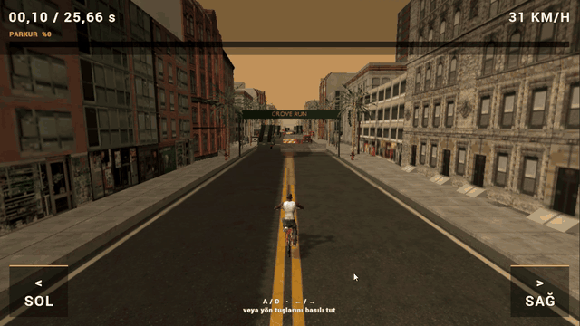
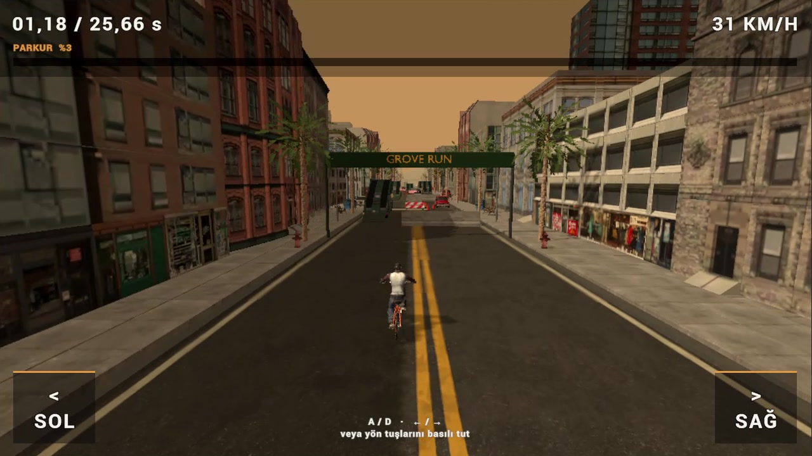
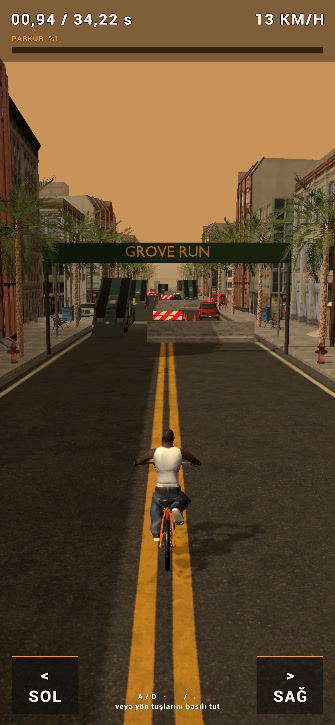
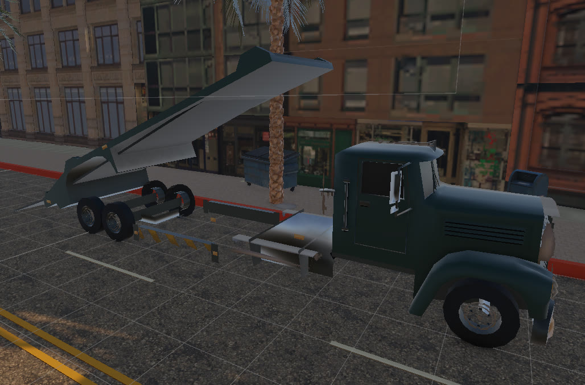

# Grove Run — TIEC Tanıtım Günleri

**Kısa bir parkur, tek bir hak ve yeniden denemek için iyi bir sebep.**

Grove Run, **tanıtım günlerinde ziyaretçilere kısa sürede etkili ve eğlenceli bir deneyim sunmak** için üç kişilik bir ekip tarafından geliştirilen bir Unity oyunudur. Ziyaretçinin uzun bir eğitim ekranı beklemeden oyuna katılabilmesi, yaklaşık yarım dakikalık bir denemede heyecan yaşayabilmesi ve cihazı sıradaki oyuncuya kolayca bırakabilmesi hedeflenir.

Oyuncu, şehir içindeki engelli bir parkurda bisikletli karaktere yön verir. İleri hareket otomatik olduğundan bütün dikkat doğru yolu seçmeye, engellerden kaçmaya ve tır rampalarını kullanmaya ayrılır. İsimle kaydedilen sonuçlar ve en iyi beş koşu, tanıtım alanında ziyaretçiler arasında küçük bir rekabet oluşturur.

<p align="center">
  
</p>

## Tanıtım günleri için oyun tasarımı

| Hedef | Oyundaki karşılığı |
|---|---|
| Hızlı katılım | Dokunarak veya bir tuşa basarak başlayan oyun |
| Kolay öğrenilen kontrol | Yalnızca sağ–sol yönlendirme; otomatik ileri hareket |
| Kısa ve heyecanlı deneyim | Güncel ayarlarda yaklaşık **26 saniyelik** tam parkur |
| Tekrar oynama isteği | Tek çarpışmada biten koşu ve hızlı yeniden başlatma |
| Etkinlikte rekabet | Oyuncu adı, tamamlanan parkur yüzdesi ve yerel skor listesi |
| Tablet kullanımı | Ekrandaki büyük yön düğmeleri ve ekran boyutuna uyumlu arayüz |

Parkur süresi ve zorluğu sabit bir video akışına bağlı değildir; proje içindeki ayarlardan değiştirilebilir.

## Oyun içi görüntüler

### Şehir parkuru ve yatay arayüz



### Dikey arayüz örneği

<p align="center">
  
</p>

### Tır rampaları ve çevre tasarımı



*GIF ve ekran görüntüleri geliştirme sırasında alınan gerçek kayıtlardır. Dikey görüntü önceki bir ayarı, tır görseli Unity'nin Scene görünümünü gösterir; bu nedenle görüntülerdeki süre ve yerleşimler sürümler arasında farklı olabilir.*

## Görsel tasarım ve harita

Haritanın görsel yönü, **San Andreas'tan ilham alan 2000'ler şehir estetiği** üzerine kuruludur: sıcak renkler, asfalt yollar, çift sarı çizgiler, birbirini takip eden bina cepheleri ve palmiyeler. Banklar, sokak lambaları, yangın muslukları ve park edilmiş araçlar sokağı tamamlar.

Parkurun oynanışını belirleyen öğeler ise araç engelleri, beton bariyerler, yol çalışmaları, kazı alanları ve yükseltilmiş tır rampalarıdır. Rampalar yalnızca dekor olarak kullanılmaz; oyuncuya bazı engellerin üzerinden geçebileceği bir rota sunar.

Çevre düzenlemesi **Blender** tarafında hazırlanır; modeller, materyaller ve çarpışma yüzeyleri **Unity** oyun sahnesine aktarılır. Hazır 3D modeller ve dokular, ekibin parkur yerleşimi ve görsel düzenlemeleriyle bir araya getirilir. Başlıklarda gotik bir yazı karakteri, oyun bilgilerinde ise kolay okunabilen bir font tercih edilir.

## Kod ve oyun mantığı

Proje **Unity 6.6**, **C#**, **Universal Render Pipeline (URP)** ve **Unity Input System** kullanır. Oyun akışı, hareket, kamera, arayüz ve skor kaydı ayrı bileşenlerde tutulur.

| Bileşen | Sorumluluk |
|---|---|
| [`RunnerSession`](Assets/TIEC_Runner/Runtime/RunnerSession.cs) | Hazır → oynanıyor → sonuç akışı, süre, bitiş ve yeniden başlatma |
| [`RunnerConfig`](Assets/TIEC_Runner/Runtime/RunnerConfig.cs) | Parkur uzunluğu, hızlanma eğrisi, zorluk ve yol sınırları |
| [`BicycleMotor`](Assets/TIEC_Runner/Runtime/BicycleMotor.cs) | İleri hareket, direksiyon, rampa desteği, uçuş ve taramalı çarpışma kontrolü |
| [`RunnerInput`](Assets/TIEC_Runner/Runtime/RunnerInput.cs) | Klavye ve dokunmatik yön girdilerinin birleştirilmesi |
| [`RunnerCamera`](Assets/TIEC_Runner/Runtime/RunnerCamera.cs) | Karakter takibi ve hıza bağlı görüş açısı |
| [`RunnerHud`](Assets/TIEC_Runner/Runtime/RunnerHud.cs) | Başlangıç, oyun göstergeleri, sonuç ekranı ve isim girişi |
| [`RunnerSafeArea`](Assets/TIEC_Runner/Runtime/RunnerSafeArea.cs) | Ekran boyutu ve güvenli alan değişikliklerine arayüzün uyumu |
| [`ScoreRepository`](Assets/TIEC_Runner/Runtime/ScoreRepository.cs) | Sonuçların cihazda saklanması ve sıralanması |
| [`CurrentBlenderMapTransfer`](Assets/GroveCurrentMap/Editor/CurrentBlenderMapTransfer.cs) | Blender haritasının materyal ve collider'larıyla oyun sahnesine aktarılması |

Hız profili, parkur mesafesi ve hedef süreye göre hesaplanır. Hareket küçük alt adımlarla ilerletilir; çarpışma kontrolü bu adımları tarar. Rampa hareketi zeminden alınan destek ve dikey hız üzerinden değerlendirilir. Skorlar `PlayerPrefs` içinde cihaz bazında saklanır.

## Nasıl oynanır?

| İşlem | Bilgisayar | Tablet |
|---|---|---|
| Başlat | **START GAME**, bir tuş veya tıklama | **START GAME** veya ekrana dokunma |
| Sola yönel | **A** / **←** basılı tut | **SOL** düğmesini basılı tut |
| Sağa yönel | **D** / **→** basılı tut | **SAĞ** düğmesini basılı tut |
| İleri git / rampadan çık | Otomatik | Otomatik |
| Sonucu kaydet | İsim gir → **KAYDET** | İsim gir → **KAYDET** |

Amaç, engellere çarpmadan yolun sonuna ulaşmaktır. Bir çarpışma koşuyu bitirir; sonuç ekranından yeni bir deneme başlatılabilir.

## Projeyi açmak

1. Depoyu **Git LFS** etkin olacak şekilde klonlayın. Model, doku, ses ve font dosyaları LFS kullanır.
2. Unity Hub'da proje klasörünü **Unity 6000.6.4f1** ile açın ve paketlerin yüklenmesini bekleyin.
3. [`Assets/Scenes/GroveRunner_Game.unity`](Assets/Scenes/GroveRunner_Game.unity) sahnesini açıp **Play** düğmesine basın.

```bash
git lfs install
git clone https://github.com/Han1AN/Tiec_Oyun_EndlessRunner.git
```

Parkur ve hız ayarları [`Assets/TIEC_Runner/RunnerSettings.asset`](Assets/TIEC_Runner/RunnerSettings.asset) dosyasındadır. Oynanabilir sahne, kaynak harita ve çalışma sahneleri `Assets/Scenes` altında bulunur.

## Ekip ve geliştirme

Grove Run, **üç kişilik bir ekip çalışmasıdır**. Harita ve çevre tasarımı, oyun programlama, arayüz ve oynanış denemeleri birlikte yürütülür. Bu depo, tanıtım günlerinde kullanılacak kısa oyun deneyiminin geliştirme sürecini içerir.

Mobil akıcılık, rampa–gövde çarpışmaları ve farklı ekran oranları üzerindeki iyileştirmeler devam etmektedir. Gerçek cihazdaki FPS ve oynanış kalitesi, kullanılan tablete ve derleme ayarlarına bağlı olarak değerlendirilir.
